由于c++里已经有现成的红黑树(map)， 所以之前由于没有应用场景， 一直没有去了解红黑树。

现在为什么会去学习红黑树:

1. js的map很不好用
    1. 必须通过get、set函数操作值
    2. 没有默认值
2. js的map底层是哈希表实现， 导出的数据顺序是插入顺序(不符合直觉)
3. 引用类型直接认为是不一样的， 没有提供自定义hash值的接口

本来想找一些第三方库， 但并没有找到比较好的, 于是打算自行填了红黑树这个坑, 实现工具自给自足。

---

前言: 红黑树是较为复杂的数据结构, 有比较多的背景知识, 所以本文将从科普平衡树的角度出发总结平衡树家族和红黑树由来。

## BST(二叉搜索树)

二叉搜索树在二叉树的基础上增加了如下性质的要求: 

1. 空树是一颗二叉搜索树
2. 二叉搜索树的左子树上任意结点的权值小于根结点
3. 二叉搜索树的右子树上任意结点的权值大于根结点
4. 二叉搜索树的左右子树均为二叉搜索树

>  从上面可以看出BST有个隐式的要求是不能出现两个权值相等的结点， 对于这种情况的处理一般是根据场景选择<后来者覆盖前者>或者<添加结点count值>

BST可以很好的解决可变序列的搜索问题。 试想一个数组里， 它将来可能需要删除某个元素， 也可能会添加进来一些元素， 你需要在这些情况发生的同时满足较快的搜索。

### BST的查找

将搜索值从根结点开始比较: 

* 当前结点权值与搜索值相同: 找到了
* 当前结点权值小于搜索值： 与左孩子进行比较
* 当前结点权值大于搜索值: 与右孩子进行比较
* 当前结点为空： 查找失败， 不存在

```typescript
searchNode(root: N | null, key: K): N | null {
    if (root === null) return null;
    const compareResult = this.compare(root.key, key);
    switch (compareResult) {
      case COMPARE_RESULT.EQUAL:
        return root;
      case COMPARE_RESULT.LESS:
        return this.searchNode(root.left, key);
      case COMPARE_RESULT.MORE:
        return this.searchNode(root.right, key);
    }
  }
```


BST的添加操作与此类似， 不再重复。

### BST的删除

首先在搜索树中查找到待删除值对应的结点。

* 待删除结点为叶子结点: 直接删除即可
* 待删除结点只有一个儿子: 删除结点后， 让唯一的儿子顶替其位置即可
* 待删除结点有两个儿子: 删除结点， 使用其【前驱】或【后继】顶替其位置

重点解释【前驱】和【后继】是什么， 以及为什么可以让它们顶替。

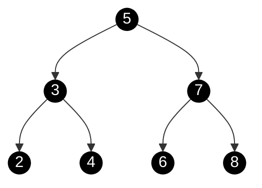

以此树距离， 此树的中序遍历序列为

```
2, 3, 4, 5, 6, 7, 8
```

对于($5$)来说， ($4$)和($6$)分别是它的前驱、后继， 因为在中序序列中它们是($5$)的前后两个结点。

当($5$)被删除时， 使用 ($4$)或($6$)来顶替它的位置， 不会破坏搜索树的性质， 以($4$)举例。

**注**:  *NIL表示占位的空节点*

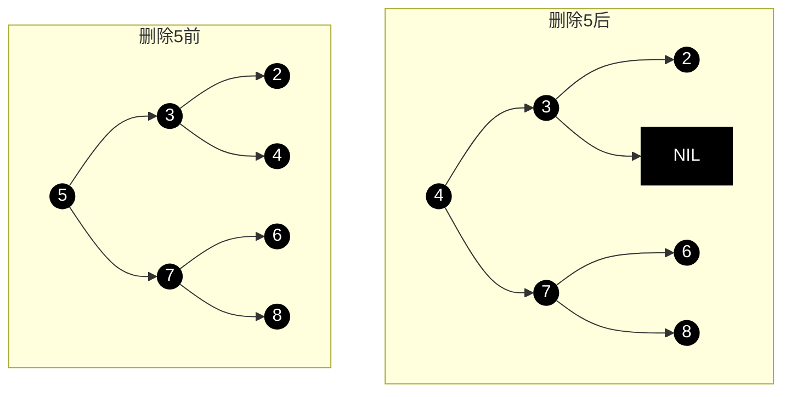

可以发现， 由于($4$)满足

1. 大于5左子树所有结点(除了4)
2. 小于5右子树所有结点

所以4天然可以取代5的位置；6同理。

N的前驱和后继的定义可以简化为:N左子树中权值最大的结点、N右子树中权值最小的结点。

### BST的最坏情况

BST进行搜索和删除的时间复杂度都与BST的高度h成正相关， 因为搜索操作最坏情况下需要从根一直比较到最深的叶子， 也就是h次比较。

即时间复杂度为$O(h)$， 而h在最好情况下为$logN$级别， 最坏情况下为$N$， 其中N为树的结点数量。

当BST为一条链时， 搜索和插入的时间复杂度为$O(N)$， 这是不能接受的。

而且通过一个有序（或大致有序）的插入顺序， 就能轻易使BST达到比较坏的情况。

```
1, 2, 3, 4, 5, 6, 7
```

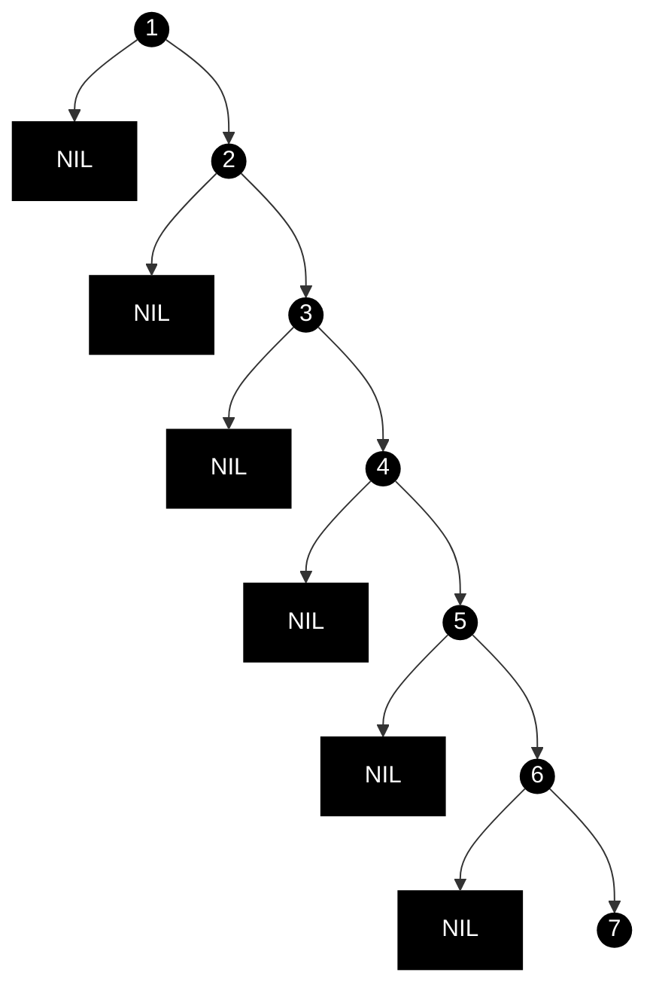


## 平衡树

平衡树是改进的二叉搜索树, 不同的平衡树关于平衡的定义有所不同， 但总的来说是在追求: 各个叶子的深度(从根到各叶子结点的简单路径长度)趋于相近/平衡 (让树的高度尽量低， 不出现某分支的深度远远的超过其他分支的情况)。

### 自平衡树

自平衡树： 在插入、删除过后会自动调整树结构使其满足平衡定义的平衡树。

自平衡树相比于二叉搜索树而言， 多了插入和删除时的维护平衡操作。

平衡树 -> 插入或删除结点(通二叉搜索树) -> 平衡树失衡 -> 维护平衡


### 树的旋转

考虑如下BST: 

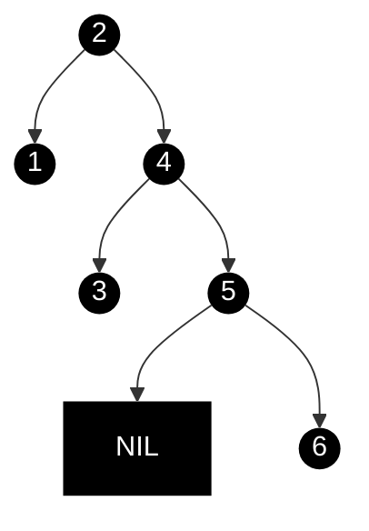

右分支深度明显的大于左分支深度, 此时我们需要调整， 使这棵树更平衡、且不破坏BST性质。

此时便可以使用旋转, 旋转操作图示如下: 


左旋、右旋的名字由来为根节点的移动方向， 具体的: 

左旋: 根结点移动到左子树上， 根结点的右儿子成为了新的根结点。

右旋: 根结点移动到右子树上,  根结点的右儿子成为了新的根结点。

从结果上看: 

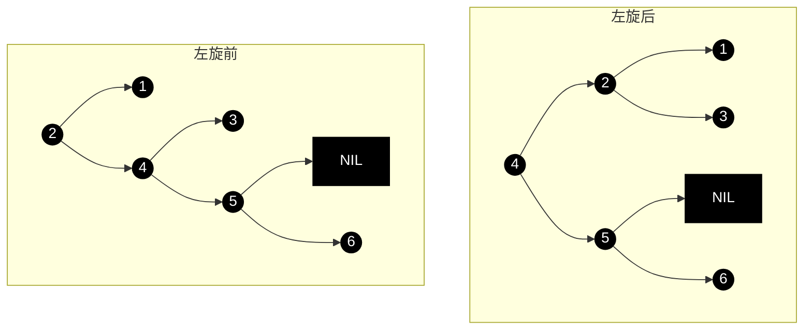


1. 旋转操作不会破坏BST性质(中序不变)
2. **左旋操作使原左子树深度+1， 原右儿子右子树深度-1。** 影响范围: (左+1、右右-1)
3. **右旋操作使原右子树深度+1， 原左儿子左子树深度-1。** 影响范围: (右+1、左左-1)

旋转操作是大多数平衡树维护平衡性质的操作， 时间复杂度为$O(1)$。

```typescript
/**
   * 左旋操作
   * @param node 左旋的子树根结点, 需要保证不为空且右子树不为空 
   * 
   *        g           p
   *       / \         / \
   *      u   p  -->  g   n
   *         / \     / \    
   *        m   n   u   m     
   */
rotateLeft(node: Node<K, V>) {
  const parent = node.parent;
  const direction = node.direction();
  const successor = node.right!;
  // 左旋核心操作, 根变为successor的左子树, successor变为根
  node.setRightChild(successor.left);
  successor.setLeftChild(node);

  // node的位置为successor取代, 需要更新node的父结点与successor的关系
  switch (direction) {
    case DIRECTION.LEFT:
      parent!.setLeftChild(successor);
      break;
    case DIRECTION.RIGHT:
      parent!.setRightChild(successor);
      break;
    case DIRECTION.ROOT:
      this.root = successor;
      break;
  }
}
```


### AVL树

AVL树的平衡定义:  对于树中任意一个结点, 其左子树深度和右子树深度的差值绝对值**不大于** $1$.

平衡因子：右子树高度 - 左子树高度

> AVL树名字的来源为它的两个发明者名字合并:  [Georgy Adelson-Velsky](https://en.wikipedia.org/wiki/Georgy_Adelson-Velsky) and [Evgenii Landis](https://en.wikipedia.org/wiki/Evgenii_Landis)

AVL树的性质保证了AVL树的高度为$logN$级别, 因此也被称为『高度平衡树』。

#### AVL树的维护操作

先说明几个事实

1. 插入/删除结点后， 可能导致包含该结点的所有子树树失衡
2. 由于是在AVL树上插入/删除了一个结点， 所以若一颗子树失衡, 其$|平衡因子|$只能为2

在AVL树插入/删除后, 我们将从插入/删除的结点的父结点开始向上(这样就能遍历到包含该结点的所有树)， 判断当前当前节点的平衡因子是否失衡， 若失衡则对当前结点进行维护。

维护操作可以分类讨论， 一些约定如下:

1. 所绘图中根结点（N）为失衡的结点(即h(L) - h(R) == 2 / -2)
2. L为N的左孩子、LL为L的左孩子(R、RR同理)
3. 结点名称后用括号注明高度
4. 『圆』为具体结点， 而梯形代指一颗树

一些事实如下:

1. 由于是自底向上进行维护， 当前讨论的是结点N, 那么L所在子树和R所在子树已经维护完成符合AVL树性质
2. 被插入/删除结点的爷爷结点开始， 才可能出现失衡

##### LL/RR型失衡

以LL型失衡举例, 这是一颗LL型失衡的树, 满足如下特征:

1. N的左子树比右子树高
1. L的左子树比右子树高 --> $H(LL) \ge H(LR)$

设$H(R) = h$， 则有

1. $H(L) = h + 2$
2. $H(LL) = h + 1$
3. $h \le H(LR) \le h + 1$

此时L和R的高度差可以看成是LL和R的高度差， 而右旋的效果为 (右+1、左左-1)满足此情况， 进行一次右旋即可。

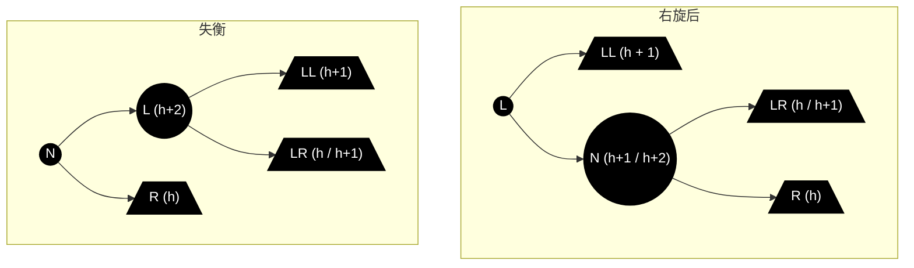

右旋后LL、LR、R的高度并不会变化， 此时我们可以计算出N的高度变为了$h + 1 \le H(N) \le h+2$, N子树和L子树都满足了AVL树性质， 修复完成!

##### LR/RL型失衡

同样只以LR型举例:

设$H(R) = h$, 则有

1. $H(L) = h + 2$;
2. $H(LL) = h$
3. $H(LR) = h + 1$
4. $h - 1 \le H(LRL) \le h$
5. $h - 1 \le H(LRR) \le h$

$LR/RL$型的失衡可以通过 L左旋 -> N右旋 来解决， 如下图

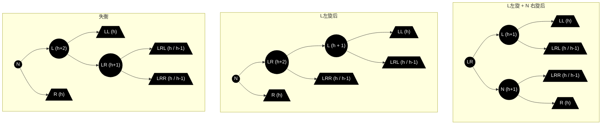

从结果上看, 操作完成后$H(L) = h + 1, H(N) = h + 1$， 符合AVL树性质。

> Todo: 是怎么想到用先后两次不同的旋转来修复性质的?是否蕴含着数学原理


### B树


B树是一种自平衡多叉树。

一颗 $m$阶B树满足如下性质:

1. 每个结点最多有$m$个子结点
2. 每个非叶子结点(除了根)至少有$\lceil m / 2 \rceil$
3. 如果根节点不是叶子节点，那么它至少有两个子节点。
4. 若一个结点有有k个子结点， 那么该结点有k-1个键， 反之亦然； 
5. 每个结点的键值升序排列， 且n的第k个子节点的所有键值满足小于n的第k个键值、大于n的第k-1个键值
6. 所有的叶子节点都在同一层。


### 红黑树

红黑树是满足如下性质的二叉搜索树:

1. 每一个结点要么是红色， 要么是黑色
2. 红色结点的孩子必须为黑色
3. 对于红黑树中任意一个结点， 它到NIL(null)结点的每一条简单路径必须包含相同数量的黑色结点

除此之外， 还有两条被广泛使用的红黑树的性质 

4. 根结点是黑色
5. NIL(null)结点被认为是黑色

这两条性质对于红黑树来说并不是必须的， 但能便利对红黑树的算法归纳， 我们姑且也认为这是红黑树必须满足的性质。


红黑树最初是从B树中推导出来的,  事实上红黑树可以等价的看做四阶B树。

#### 红黑树与4阶B树

以下引用自: [红黑树 | Jason‘s Blog (jasonxqh.github.io)](https://jasonxqh.github.io/2020/11/03/红黑树/)

> 红黑树和4阶B树之间存在等价关系。如哦从红黑树的树根开始，自顶向下逐层检查，如果遇到红结点，则将该节点压缩到父节点一侧；如果遇到黑节点，则保留。因为**红结点对黑高没有贡献**，而黑结点对黑高有贡献。
>
> 红黑树与4阶B树的4种等价方式：
>
> 1） 两个黑孩子(黑黑)，如图所示：
>
> 
>
> 2）左黑右红(黑红)，如图所示：
>
> 
>
> \3) 左红右黑(红黑) ，如图所示：
>
> 
>
> 4）两个红孩子(红红)，如图所示
>
> 
>
> 从红黑树与4阶B树的等价关系可以看出，4阶B树中的结点中必然含有一个黑节点。而且不会出现红色的父亲。每一个结点最多包含三个关键字：如果包含2个红关键字，则黑关键字必然在中间位置。
>
> 我们可以尝试将这一棵红黑树进行压缩。
>
> 
>
> 最后可以得到这样一棵4阶的B树
>
> 
>
> 那么既然红黑树和4阶B树是可以互相转化的，那么为什么还要用红黑树呢？这是因为红黑树和B树处理的方向不同。B树主要用于内外存的访问，旋转不是很容易，但是红黑树的旋转调平衡比较方便


#### 插入

红黑树的插入， 首先将插入结点按照BST的规则插入树中， 然后判断是否会导致失衡， 根据其情况使用不同策略进行修正。

一些约定:

1. N为插入的结点
2. P为`parent`父亲结点
3. G为`grandparent`爷爷结点
4. U为`uncle`叔叔结点
5. 圆形结点为具体的节点； 梯形结点代表一颗无需透露细节的子树
6. 结点名称后如有括号， 则表示该节点到叶子结点的黑色数量

一些事实:

1. 插入的结点必然为红色结点。 因为被插入的树已经满足红黑树性质， 此时如果插入一个黑色结点， 那么必然会让某条路径的黑色数量+1， 造成失衡(除空树情况)
2. 空树情况下， 将插入结点更改为黑色即可
3. 插入结点的父亲为黑色时， 不会破坏红黑树性质。 

排除以上情况时， 必然满足:

1. 插入结点有父结点且父结点为红色
2.  插入结点有爷爷且爷爷为黑色

接下来我们将以`uncle`为 红/黑 时分类讨论剩下的失衡情况。

##### uncle为红色时

此时我们将G染红， P和U染黑，此时G子树已经修正了性质， 但G变红可能导致更上层的失衡， 因此我们将G当成刚插入的结点， 递归地维护。 

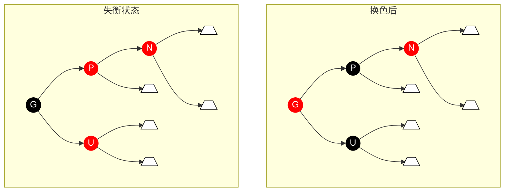

```typescript
if (uncle && uncle.isRed()) {
  uncle.setBlack();
  parent.setBlack();
  gparent.setRed();
  this.maintainAfterInsert(gparent);
  return;
}
```


##### uncle为黑色时: LL/RR型失衡

以`LL`型失衡举例(P为G的左儿子， N为P的左儿子)

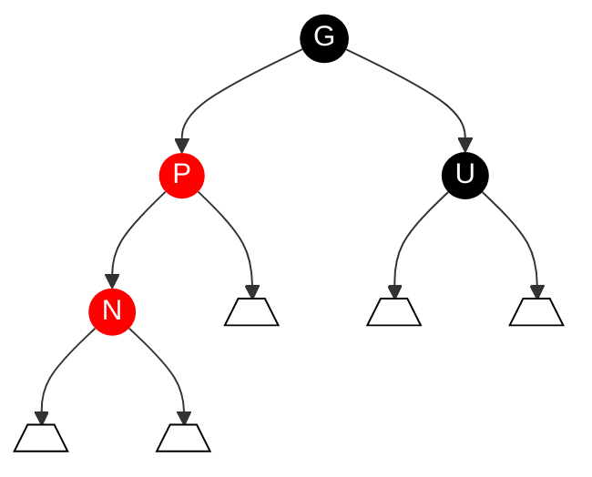

我们从4阶B树的角度上看(B树的图非常重要非常好):


在不破坏搜索树性质的情况下， 如上B树只需交换p、g颜色即可。

> 回收前文的一些疑问:
>
> **为什么要分uncle为红还是黑？**
>
> 由上图可以发现， 当uncle为红时， x-p-g这一层还要加一个u变成 x-p-g-u
>
> 
>
> 4阶B树的结点键值数超过了3， 此时发生上溢， 需要进行分裂操作， 如上图。
>
> g变为红色后, g的上层可能失衡， 因此需要递归向上解决。
>
> **叶子结点为什么要认为是黑色?**
>
> 在解决红黑树的失衡过程中， 经常遇到需要根据某个结点的颜色分类讨论的情况, 但我们发现，讨论结点的颜色其实只是在区分  红色(B树形式中会压缩到父结点) / 非红色(不会在父结点中) 两种情况。
>
> 所以没有必要每次都加一条: 如果为空， 如何如何。


而由于4阶B树形式中黑色为根结点， 换成二叉树操作需要分为两步:

1. 基于g进行右旋
2. 将p染黑， g染红

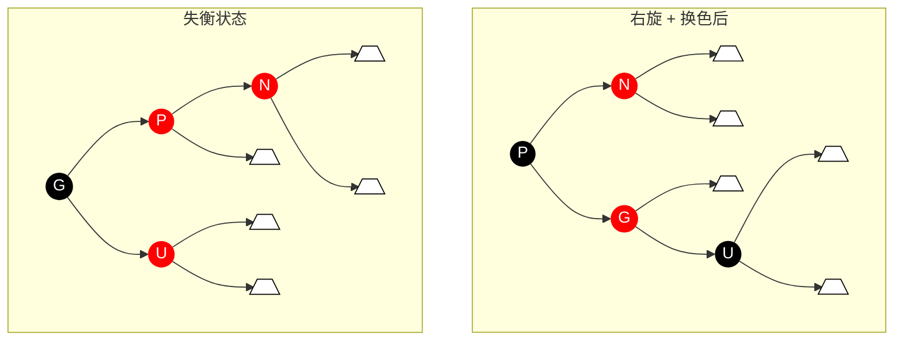

```typescript
if (parent.direction() === node.direction()) {

  if (node.direction() === DIRECTION.LEFT) {
    // LL型失衡
    this.rotateRight(gparent);
  } else {
    // RR型失衡
    this.rotateLeft(gparent);
  }

  parent.setBlack();
  gparent.setRed();
}
```

##### uncle为黑色时: LR/RL型失衡

以LR型失衡举例(P为G的左儿子， N为P的右儿子):

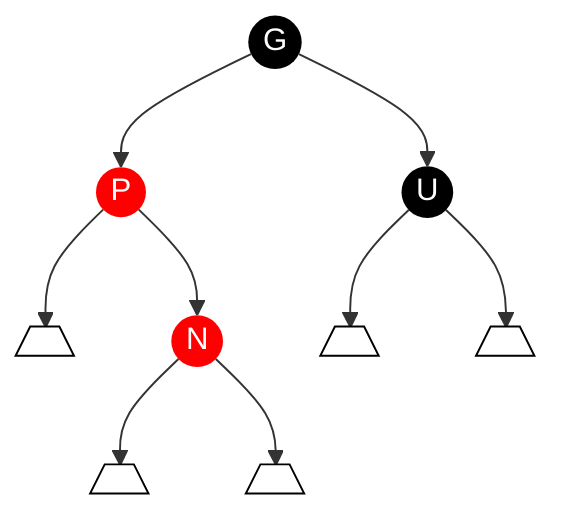

同样转化为4阶B树形式:


同样是出现了连续的红色， 同样把中间染黑， 但LR要进行的操作要多一点： 

1. 基于P进行左旋

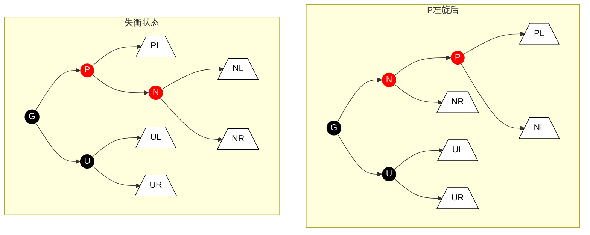

2. 基于G右旋
3. 将N染黑, 将G染红

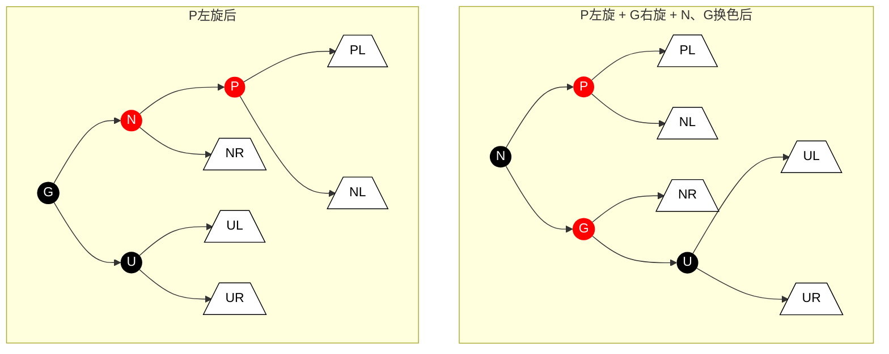

#### 删除

在删除过程中， 我们现对欲删除的键值进行搜索， 在搜索到的节点为N的情况下:

> 1. 若N有两个孩子， 将其前驱(或后继)结点的键与值与N替换(不替换颜色)，此时要删除的结点改为了前驱(或后继)结点

经过了`(1)`， 我们确认了要删除的结点究竟是哪个, 接下来以N代指要删除的结点, 此时我们继续分情况讨论: 

> 2. 若N为树中唯一的结点， 直接删除即可

> 3. 若N有左/右孩子, 删除N后用它的左/右孩子代替N的位置(由于前驱或后继的性质, N不可能有两个孩子)

`(2)`、`(3)策略保证了删除后BST的性质正确,  接下来从红黑树性质上考虑删除后如何修正: 

> 4. 若N为红色, 不会破坏红黑树性质， 无需维护

当删除一个红色结点时, 并不会改变路径中黑色结点的数量； 同时顶替它位置的左/右孩子 和 父亲(如果存在) 必然是黑色结点, 不会破坏*红色结点的孩子必须为黑色*的性质

> 5. 若N有孩子
>     1. N的孩子必然为红色， 否则N子树不满足红黑树性质

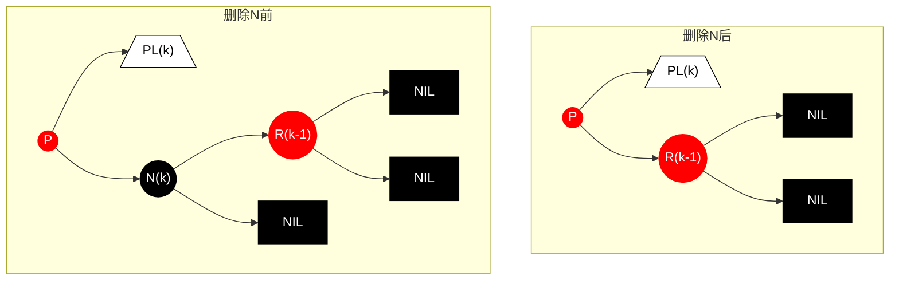

删除N后, N所在路径的黑色数量减少， 必然导致不同路径的黑色数量不同； 且当P为红色时， 又破坏了红结点孩子必须为黑结点的性质。

此时我们将R染黑， 就同时解决了两条性质的失衡问题:

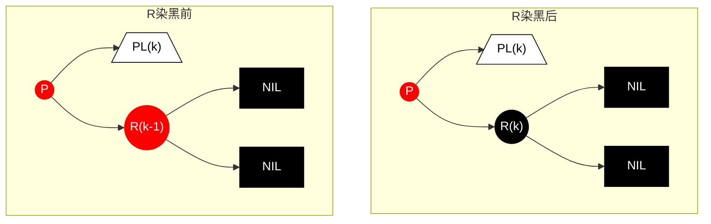

##### 删除操作修正原理

让我们思考删除一个黑色结点N造成的后果, 本质上就是P(N的父亲)的两颗子树的黑色深度不再相等(**N所在子树黑色深度减一**)， 此时解决方法无非:

1. 在保证P树黑色深度不变的情况下， 弥补N所在子树减少的黑色深度, 此时必然需要有一个红色结点被染成了黑色结点
    * 被染黑的红色结点哪里来? 
        * 在N所在子树上， 代替N位置
        * 在S子树上,  需要调整结构让N子树多一个黑色结点
        * P染黑, S染红
    
1. (1)无法实现的情况下, 维护两颗子树黑色深度相同且将P树整体的黑色深度减一， 此时相当于"P被删了"， 向上递归维护。

我想表达的意思是, 删除黑色叶子结点后的维护操作, 应该将其看作一个整体、一颗子树的黑色深度减一， 但它内部依然符合红黑树性质， 这样去理解， 进而复用到更广的情况。

我们重回`(5)`的情况, 5的情况本质是N子树的黑色数量减了1， 所以用了一个本身在N子树上的红色结点染黑进行替代

而在N子树内部解决不了问题， 就将问题抛给了上层。 

**P为红色, S和S两个孩子均为黑色 **

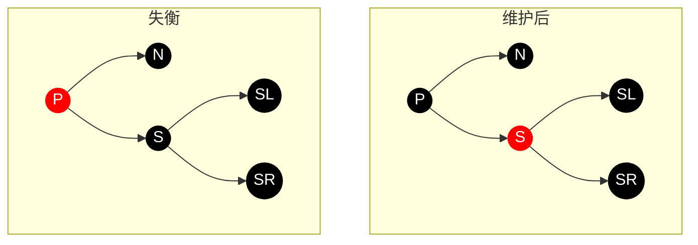

此时将P染黑、S染红, 显然符合:

1. P子树和S路径黑色深度不变
2. s子树红黑树性质未遭到破坏
3. N路径黑色深度+1

即成功的为N擦了屁股。

```typescript
sibling.setRed();
parent.setBlack();
```


**P为黑色， S和S两个孩子均为黑色**

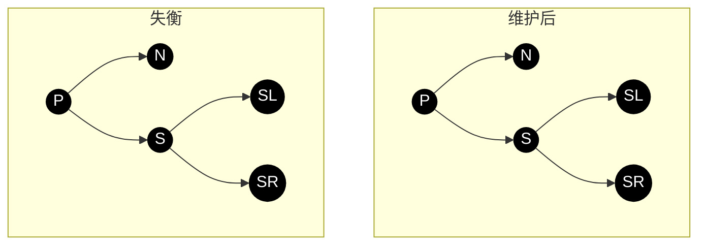


我们将S染红， P的两条路径下的黑色深度都减一, 将问题抛给上层。

```typescript
sibling.setRed();
this.maintain(parent.parent);
```

**P任意, S为黑色， N远侄为红色, 近侄任意**

> 当N为P左儿子时， S的左儿子为近侄， 右儿子为远侄； 反之同理。

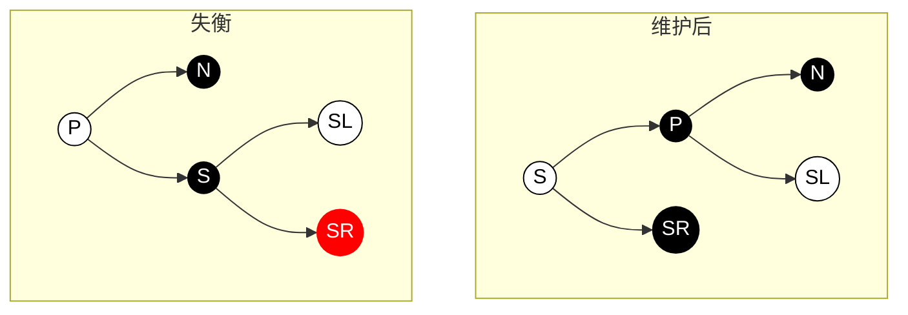

1. P向N方向旋转
2. S和P交换颜色, 远侄染黑

此时各方面都满足性质

**P任意,  N近侄为红色， 远侄为黑色**

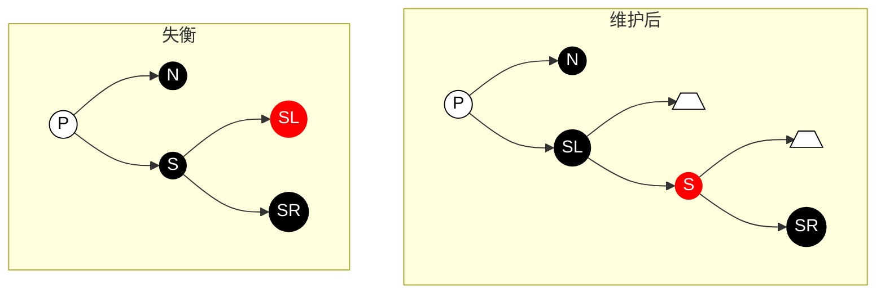

1. 将S向远侄方向右旋
2. 将近侄染黑， S染红

此时情况变为了**P任意, S为黑色， N远侄为红色, 近侄任意**, 用同样方法解决即可。

以上四种情况， 我们枚举完了S为黑色的所有情况, 接下来考虑S为红色的情况

**S为红色**

此时P和S的孩子只能为黑色, 且S必然有真实孩子

1. P向N方向旋转
2. P染红, S染黑

 ```mermaid
 %%{ init: { 'flowchart': { 'curve': 'basis' } } }%%
 flowchart TD
 subgraph 维护后
 s((S))
 p((P))
 sr((SR))
 n((N))
 sl((SL))
 
 s --> p
 p --> n
 p --> sl
 s --> sr
 end
 subgraph 失衡
 P((P))
 N((N))
 S((S))
 SL((SL))
 SR((SR))
 
 P --> N
 P --> S
 S --> SL
 S --> SR
 end
 classDef tree fill: white, color: black, stroke: black
 classDef blackNode fill: black,color: white,stroke:none
 classDef redNode fill: red,color: white,stroke: none
 class S,p redNode;
 class N,P,SL,SR,s,n,sl,sr blackNode;
 class PL,NL,UL,UR,pl tree
 ```

此时可以发现整棵树相比之前的变化就是N下移， sibling变为了SL， 其他部分并未失衡。

继续在新的P子树上继续维护即可。

```typescript
if (sibling.isRed()) {
  if (direction === DIRECTION.LEFT) {
    this.rotateLeft(parent);
  } else {
    this.rotateRight(parent);
  }
  sibling.setBlack();
  parent.setRed();
  this.afterErase(parent);
}
```


### 红黑树和AVL树的比较

1. 如果插入一个node引起了树的不平衡，AVL和RB-Tree都是最多只需要2次旋转操作，即两者都是O(1)；但是在删除node引起树的不平衡时，最坏情况下，AVL需要维护从被删node到root这条路径上所有node的平衡性，因此需要旋转的量级O(logN)，而RB-Tree最多只需3次旋转，只需要O(1)的复杂度。
2. AVL的结构相较RB-Tree来说更为平衡，在插入和删除node更容易引起Tree的unbalance，因此在大量数据需要插入或者删除时，AVL需要rebalance的频率会更高。因此，RB-Tree在需要大量插入和删除node的场景下，效率更高。自然，由于AVL高度平衡，因此AVL的search效率更高。

## 参考

[rbtree.c-linux源码](https://elixir.bootlin.com/linux/latest/source/lib/rbtree.c)

[红黑树 - OI Wiki (oi-wiki.org)](https://oi-wiki.org/ds/rbtree/#case-4)

[红黑树（图解+秒懂+史上最全） - 疯狂创客圈 - 博客园 (cnblogs.com)](https://www.cnblogs.com/crazymakercircle/p/16320430.html#autoid-h3-8-8-0)

[红黑树 | Jason‘s Blog (jasonxqh.github.io)](https://jasonxqh.github.io/2020/11/03/红黑树/)

[数据结构-B树与红黑树 - Shuzang's Blog](http://shuzang.top/2020/data-structure-b-tree-and-red-black-tree/#24-删除)

[Red–black tree - Wikipedia](https://en.wikipedia.org/wiki/Red–black_tree)

[The-Art-Of-Programming-By-July-2nd/ebook/zh/03.01.md at master · julycoding/The-Art-Of-Programming-By-July-2nd (github.com)](https://github.com/julycoding/The-Art-Of-Programming-By-July-2nd/blob/master/ebook/zh/03.01.md)

[平衡树 - 维基百科，自由的百科全书 (wikipedia.org)](https://zh.wikipedia.org/wiki/平衡树)

Weiss M A. 数据结构与算法分析 C语言描述（第2版）. 冯舜玺 译. 机械工业出版社, 2004.

## 红黑树参考代码

见: [trudbot/easy-map (github.com)](https://github.com/trudbot/easy-map?tab=readme-ov-file)

